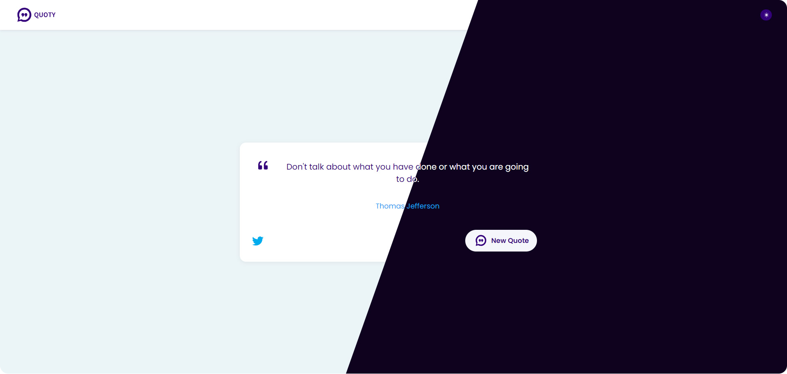

<br/>

[Quoty](https://aminawinti.github.io/quoty/) app displays famous quotes from various historical figures each time a button is clicked. It was originally built as part of a [FreeCodeCamp](https://www.freecodecamp.org/learn/front-end-development-libraries/front-end-development-libraries-projects) project. It is developed using React.js

You can fetch data in two ways:

<ol>  
<li>use <strong>local</strong> dummy data:  `data/quotes.json`</li>  
<li>consume <strong>remote API</strong>: `'type.fit/api/quotes` </li> 
</ol>

## ✨ Try it out

[Quoty](https://aminawinti.github.io/quoty/)

# Install

- Clone the repository:

```bash
git clone https://github.com/Amin-Awinti/quoty-app.git

```

- Install the packages using the command `npm install`

# Run

- After installing the required packages, run the app using the command `npm run dev`

# Used libraries

- `react-js`
- `react-icons`

Check `package.json` for details

<br/>
Thank You ^_^
